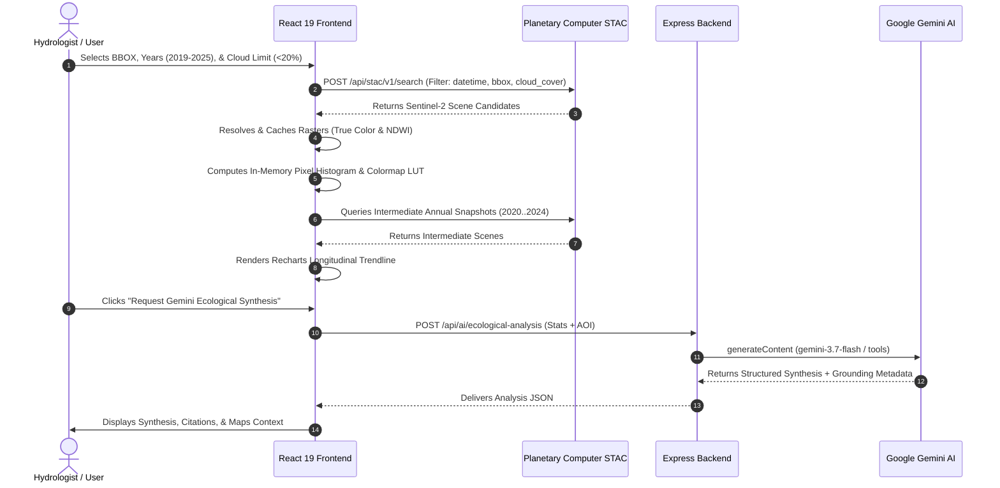

# 🌊 AquaSense: Comprehensive Project Architecture, Scientific Foundations & Technical Deep Dive

---

## 📑 Table of Contents

1. [Executive Summary & Environmental Problem Statement](#1-executive-summary--environmental-problem-statement)
2. [Earth Observation & Remote Sensing Fundamentals](#2-earth-observation--remote-sensing-fundamentals)
   - [Sentinel-2 MultiSpectral Instrument (MSI) Bands](#sentinel-2-multispectral-instrument-msi-bands)
   - [Physical Basis of the Normalized Difference Water Index (NDWI)](#physical-basis-of-the-normalized-difference-water-index-ndwi)
   - [Quantification Mathematics: Pixel-to-Area Scaling](#quantification-mathematics-pixel-to-area-scaling)
3. [Algorithmic & Client-Side Raster Engine](#3-algorithmic--client-side-raster-engine)
   - [Grayscale Range Mapping & Dynamic Thresholding](#grayscale-range-mapping--dynamic-thresholding)
   - [High-Performance 256-Color Look-Up Table (LUT) Colorization](#high-performance-256-color-look-up-table-lut-colorization)
   - [Temporal Change Detection: Tri-State Differencing Algorithm](#temporal-change-detection-tri-state-differencing-algorithm)
4. [Machine Learning & Geospatial Foundation Models](#4-machine-learning--geospatial-foundation-models)
   - [Limitations of Classical Spectral Indices](#limitations-of-classical-spectral-indices)
   - [Earth Observation Foundation Model Encoders (Prithvi-100M & Clay v1)](#earth-observation-foundation-model-encoders-prithvi-100m--clay-v1)
   - [Few-Shot Classifier Mathematics & Implementation](#few-shot-classifier-mathematics--implementation)
   - [Model State Serialization & Edge Portability](#model-state-serialization--edge-portability)
5. [Google Gemini Multimodal AI & Grounding Architecture](#5-google-gemini-multimodal-ai--grounding-architecture)
   - [Deep Ecological Reasoning (`gemini-3.7-flash`)](#deep-ecological-reasoning-gemini-37-flash)
   - [Google Search Grounding (`gemini-3.5-flash`)](#google-search-grounding-gemini-35-flash)
   - [Google Maps Geographic Landmark Grounding (`gemini-3.5-flash`)](#google-maps-geographic-landmark-grounding-gemini-35-flash)
   - [Multimodal Field & Drone Photo Ground-Truthing](#multimodal-field--drone-photo-ground-truthing)
   - [Resilient Model Fallback Hierarchy](#resilient-model-fallback-hierarchy)
6. [End-to-End System Architecture & Data Flow](#6-end-to-end-system-architecture--data-flow)
   - [Client-Server Separation & Responsibilities](#client-server-separation--responsibilities)
   - [STAC Ingestion & Candidate Fallback Algorithm](#stac-ingestion--candidate-fallback-algorithm)
   - [Multi-Year Longitudinal Time-Series Construction](#multi-year-longitudinal-time-series-construction)
7. [User Interface & Cartographic Design System](#7-user-interface--cartographic-design-system)
   - [Split-Screen Comparison Slider](#split-screen-comparison-slider)
   - [8-Point Anchor Interactive BBOX Map Editor](#8-point-anchor-interactive-bbox-map-editor)
   - [Dynamic Color Ramp Selection & Needle Indicator](#dynamic-color-ramp-selection--needle-indicator)
8. [Case Study: Pallikaranai Marshland Ecological Monitoring](#8-case-study-pallikaranai-marshland-ecological-monitoring)
9. [Scientific Provenance & Audit Trail Metadata](#9-scientific-provenance--audit-trail-metadata)
10. [Future Directions & Extensibility](#10-future-directions--extensibility)

---

## 1. Executive Summary & Environmental Problem Statement

Freshwater bodies, inland wetlands, coastal lagoons, and reservoirs are among the most critical yet vulnerable ecosystems on Earth. They regulate flood risks, recharge aquifers, sustain biodiversity, and cycle nutrients. However, rapid urban expansion, climate change, agricultural diversion, and industrial encroachment have caused unprecedented degradation and volumetric loss in global surface water resources.

Traditional hydrological monitoring relies on manual field sampling or static GIS surveys, which are:
- **Costly and labor-intensive**, limiting temporal frequency to annual or decadal surveys.
- **Spatially restricted**, unable to continuously capture basin-wide macro trends.
- **Disconnected from modern AI capabilities**, lacking real-time reasoning, news verification, and automated ecological reporting.

**AquaSense** bridges this gap by unifying:
1. **SpatioTemporal Asset Catalog (STAC)** automated satellite data pipelines.
2. **Sub-second in-browser raster processing** for instant hydrological threshold tuning.
3. **Few-shot transfer learning** over geospatial Foundation Models (ViT-Base).
4. **Multimodal Generative AI (Google Gemini 3.7 & 3.5)** with live Search & Maps Grounding.

The result is a cartographic observatory that turns petabytes of raw multispectral satellite data into actionable ecological intelligence.

---

## 2. Earth Observation & Remote Sensing Fundamentals

### Sentinel-2 MultiSpectral Instrument (MSI) Bands

AquaSense utilizes Level-2A (Bottom-Of-Atmosphere reflectance) multispectral imagery acquired by the European Space Agency's (ESA) **Copernicus Sentinel-2** constellation. Sentinel-2 carries the MultiSpectral Instrument (MSI), which samples 13 spectral bands across visible, near-infrared (NIR), and shortwave infrared (SWIR) wavelengths.

| Band Name | Central Wavelength ($\lambda$) | Spatial Resolution | Hydrological Role in AquaSense |
|---|---|---|---|
| **B02 (Blue)** | $490\text{ nm}$ | $10\text{ m}$ | Natural true-color RGB rendering & water body clarity |
| **B03 (Green)** | $560\text{ nm}$ | $10\text{ m}$ | **Primary NDWI numerator band** (high reflectance in water) |
| **B04 (Red)** | $665\text{ nm}$ | $10\text{ m}$ | Natural true-color RGB rendering & vegetation chlorophyll absorption |
| **B08 (NIR)** | $842\text{ nm}$ | $10\text{ m}$ | **Primary NDWI denominator band** (near-total absorption by water) |
| **B11 (SWIR-1)** | $1610\text{ nm}$ | $20\text{ m}$ | Moisture stress & foundation model feature encoding |
| **B12 (SWIR-2)** | $2190\text{ nm}$ | $20\text{ m}$ | Soil moisture & foundation model feature encoding |

### Physical Basis of the Normalized Difference Water Index (NDWI)

Formulated by McFeeters (1996), the Normalized Difference Water Index exploits the drastic contrast in spectral behavior between liquid water and terrestrial surfaces (vegetation and soil):

$$\text{NDWI} = \frac{\rho_{\text{Green}} - \rho_{\text{NIR}}}{\rho_{\text{Green}} + \rho_{\text{NIR}}} = \frac{B03 - B08}{B03 + B08}$$

#### Spectral Rationale:
1. **Clear Water**: Exhibits moderate reflectance in visible green wavelengths ($\approx 560\text{ nm}$) but experiences strong absorption in the near-infrared region ($\approx 842\text{ nm}$). Thus, $\rho_{\text{Green}} \gg \rho_{\text{NIR}}$, yielding positive NDWI values ($\text{NDWI} > 0$).
2. **Terrestrial Vegetation**: High chlorophyll reflection in NIR due to the leaf spongy mesophyll layer results in $\rho_{\text{NIR}} \gg \rho_{\text{Green}}$, producing strongly negative NDWI values ($\text{NDWI} < 0$).
3. **Bare Soil & Built-up Surfaces**: Exhibit higher reflectance in NIR than in green, typically generating values near zero or slightly negative ($\text{NDWI} \approx -0.2 \text{ to } 0.1$).

```
Reflectance (%)
  ▲
60│                        ┌─ Vegetation (Spongy Mesophyll Reflection)
  │                       /
40│                      /
  │         Green (B03) /
20│          ▲         /
  │         / \       /
 0└───┬────/───\─────/──────────┬────────► Wavelength (nm)
     400  560   \   /          842 (NIR B08)
                 ▼ 
            Water Absorption (Near Zero)
```

### Quantification Mathematics: Pixel-to-Area Scaling

Sentinel-2 Level-2A visual and near-infrared bands are gridded at a spatial resolution of:
$$\Delta x = 10\text{ m}, \quad \Delta y = 10\text{ m}$$

Each individual pixel represents a physical ground surface area of:
$$A_{\text{pixel}} = 10\text{ m} \times 10\text{ m} = 100\text{ m}^2$$

Converting to square kilometers ($\text{km}^2$):
$$A_{\text{pixel}} = \frac{100\text{ m}^2}{1{,}000{,}000\text{ m}^2/\text{km}^2} = 0.0001\text{ km}^2/\text{pixel}$$

Thus, for any binary water mask consisting of $N_{\text{water}}$ pixels that satisfy the threshold condition:
$$A_{\text{total}}(\text{km}^2) = N_{\text{water}} \times 0.0001$$

The temporal change between baseline epoch $T_0$ and target epoch $T_1$ is calculated as:
$$\Delta A = A(T_1) - A(T_0) = \left(N_{\text{water}}(T_1) - N_{\text{water}}(T_0)\right) \times 0.0001\text{ km}^2$$
$$\Delta A_{\%} = \left(\frac{A(T_1) - A(T_0)}{A(T_0)}\right) \times 100$$

---

## 3. Algorithmic & Client-Side Raster Engine

### Grayscale Range Mapping & Dynamic Thresholding

When requesting dynamic raster expressions from Microsoft Planetary Computer:
```
expression=(B03-B08)/(B03+B08)&rescale=-1,1
```
The server rescales the theoretical continuous NDWI domain $[-1.0, 1.0]$ into an 8-bit unsigned integer grayscale channel $[0, 255]$:

$$I(x, y) = \text{round}\left( \frac{\text{NDWI}(x, y) - (-1)}{1 - (-1)} \times 255 \right) = \text{round}\left( \frac{\text{NDWI}(x, y) + 1}{2} \times 255 \right)$$

To provide instant interactivity, AquaSense performs real-time client-side pixel evaluation on an HTML5 2D Canvas context:

```typescript
export function ndwiToPixelCutoff(threshold: number): number {
  const clamped = Math.max(-1, Math.min(1, threshold));
  return Math.round(((clamped + 1) / 2) * 255);
}
```

When a user adjusts the NDWI threshold slider (e.g. from $+0.15$ to $+0.30$), the system updates the cutoff integer $C_{\text{cutoff}}$ and scans the in-memory `Uint8ClampedArray` without re-fetching any imagery over the network.

### High-Performance 256-Color Look-Up Table (LUT) Colorization

Standard client-side colormap generation can cause frame drops if trigonometric or polynomial interpolations are calculated per pixel. AquaSense implements a 256-entry Look-Up Table (LUT) cache:

```
Grayscale Pixel Value [0..255] ──► Array Index [0..255 * 3] ──► [R, G, B]
```

1. **Table Pre-computation**: A flat `Uint8Array(768)` is computed once for each scientific palette (*Viridis*, *Inferno*, *Turbo*, *Cividis*, *Mako*, *Blues*, *Chlorophyll*).
2. **Direct Byte Indexing**: For pixel $i$, with intensity $v = \text{data}[i]$, its color is assigned via:
   ```typescript
   const lutIdx = rawVal * 3;
   data[i]     = lut[lutIdx];     // Red
   data[i + 1] = lut[lutIdx + 1]; // Green
   data[i + 2] = lut[lutIdx + 2]; // Blue
   data[i + 3] = 255;             // Alpha
   ```
3. **Subdued Background Masking**: When non-water terrain masking is enabled, pixels below the cutoff are rendered in a dark desaturated tone with $25\%$ alpha transparency, highlighting the water body.

### Temporal Change Detection: Tri-State Differencing Algorithm

To analyze wetland inundation or desiccation, AquaSense processes two synchronized rasters ($T_0$ baseline and $T_1$ target) through a tri-state classification algorithm:

```typescript
const isWaterA = valA > cutoff;
const isWaterB = valB > cutoff;

if (isWaterA && !isWaterB) {
  // WATER LOST (Desiccation / Encroachment) -> Signal Red [239, 68, 68, 255]
} else if (!isWaterA && isWaterB) {
  // WATER GAINED (Inundation / Flooding) -> Electric Blue [59, 130, 246, 255]
} else if (isWaterA && isWaterB) {
  // PERSISTENT WATER -> Color Ramp Scaled Deep Navy [R_lut, G_lut, B_lut, 230]
} else {
  // NON-WATER TERRAIN -> Fully Transparent [0, 0, 0, 0]
}
```

This tri-state mask is composited on top of a desaturated true-color base image, instantly revealing geographic boundary changes.

---

## 4. Machine Learning & Geospatial Foundation Models

### Limitations of Classical Spectral Indices

While fixed spectral indices like NDWI are computationally lightweight, they have known limitations:
- **Algae & Macrophyte Blooms**: Dense vegetation mats (e.g. water hyacinth) reflect heavily in NIR, causing NDWI to misclassify infested water as dry land.
- **Turbidity & Sedimentation**: Suspended solids increase red and NIR backscatter, distorting water classification.
- **Urban Shadows**: Building shadows create low reflectance across all bands, occasionally mimicking water.

To overcome these limitations, AquaSense incorporates Earth Observation Foundation Models and Few-Shot Learning.

```
Raw Sentinel-2 Multispectral Scene (B02, B03, B04, B08, B11, B12)
                          │
                          ▼
            Tiling & Patch Extraction (224x224)
                          │
                          ▼
       Earth Observation Foundation Model Encoder
          (IBM-NASA Prithvi-100M / Clay v1)
                          │
                          ▼
         768-Dimensional Dense Feature Vector
                          │
                          ▼
         FewShotClassifier (Trained with N=5..20)
       ├── One-vs-Rest L2-Regularized Logistic Regression
       └── Cosine-Weighted k-Nearest Neighbors
                          │
                          ▼
Class Probabilities: ['water', 'wetland', 'built_up'] + Confidence Scores
```

### Earth Observation Foundation Model Encoders (Prithvi-100M & Clay v1)

AquaSense defines an extensible encoder architecture (`ml/encoders/`):
- **IBM-NASA Prithvi-100M**: A temporal Vision Transformer (ViT-Base) pre-trained on Sentinel-2 multi-spectral data across global biomes using masked autoencoding. It takes $224 \times 224 \times 6$ tensors and outputs 768-dimensional latent representations.
- **Clay v1**: A foundation model for multitemporal satellite representations.
- **Adaptive VRAM Batch Sizing**: Dynamically computes mini-batch sizes based on available GPU memory:
  $$\text{Batch Size} = \max\left(1, \min\left(64, \left\lfloor \frac{\text{VRAM}_{\text{free}} - 1024\text{ MB}}{150\text{ MB/patch}} \right\rfloor \right)\right)$$

### Few-Shot Classifier Mathematics & Implementation

The `FewShotClassifier` (`ml/classifiers/few_shot.ts` and `few_shot.py`) classifies foundation model embeddings using small sets of user-labeled reference patches.

#### 1. One-vs-Rest (OvR) $L_2$-Regularized Logistic Regression
For each class $c \in \mathcal{C}$, the model minimizes the binary cross-entropy loss with $L_2$ weight regularization:

$$\mathcal{L}(\mathbf{w}_c, b_c) = -\frac{1}{N} \sum_{i=1}^{N} \left[ w_i^+ y_i \log \sigma(z_i) + w_i^- (1 - y_i) \log(1 - \sigma(z_i)) \right] + \frac{1}{2C} \|\mathbf{w}_c\|_2^2$$

where:
- $z_i = \mathbf{w}_c^T \mathbf{x}_i + b_c$
- $\sigma(z) = \frac{1}{1 + e^{-z}}$
- Class balancing weights: $w^+ = \frac{N}{2 N^+}$, $w^- = \frac{N}{2 N^-}$
- Multi-class probabilities are computed via the softmax temperature function:
  $$P(y = c \mid \mathbf{x}) = \frac{e^{\mathbf{w}_c^T \mathbf{x} + b_c}}{\sum_{k \in \mathcal{C}} e^{\mathbf{w}_k^T \mathbf{x} + b_k}}$$

#### 2. Cosine Distance $k$-Nearest Neighbors
Given test embedding $\mathbf{x}$ and reference embeddings $\{\mathbf{r}_1, \dots, \mathbf{r}_M\}$:

$$d_{\text{cosine}}(\mathbf{x}, \mathbf{r}_j) = 1 - \frac{\mathbf{x} \cdot \mathbf{r}_j}{\|\mathbf{x}\|_2 \|\mathbf{r}_j\|_2}$$

Votes from the top-$k$ nearest reference patches are weighted by inverse distance:
$$w_j = \frac{1}{d_{\text{cosine}}(\mathbf{x}, \mathbf{r}_j) + \epsilon}$$
$$P(c \mid \mathbf{x}) = \frac{\sum_{j \in \text{top-}k, y_j = c} w_j}{\sum_{j \in \text{top-}k} w_j}$$

### Model State Serialization & Edge Portability

To support reproducible scientific workflows, `FewShotClassifier` can serialize its complete state into JSON:

```json
{
  "method": "logistic_regression",
  "classes": ["built_up", "water", "wetland"],
  "modelWeights": {
    "classes": ["built_up", "water", "wetland"],
    "coef": { "water": [0.042, -0.128, "...768 floats..."] },
    "intercept": { "water": 0.812 },
    "dim": 768
  },
  "referenceEmbeddings": [ "...N vectors..." ],
  "referenceLabels": ["water", "wetland", "built_up"]
}
```

This state can be saved to disk, checked into version control, or loaded in edge inference environments.

---

## 5. Google Gemini Multimodal AI & Grounding Architecture

AquaSense integrates Google's latest Gemini models via `@google/genai` to provide ecological synthesis and multimodal validation.

```
                          ┌───────────────────────────┐
                          │  Google Gemini Engine     │
                          └─────────────┬─────────────┘
                                        │
      ┌──────────────────┬──────────────┴─────────────┬──────────────────┐
      │                  │                            │                  │
┌─────▼──────────┐ ┌─────▼──────────┐          ┌──────▼───────────┐ ┌────▼─────────────┐
│ Deep Reasoning │ │ Search Grounded│          │  Maps Grounded   │ │ Multimodal Vision │
│ gemini-3.7-flash│ │gemini-3.5-flash│          │ gemini-3.5-flash │ │ gemini-3.7-flash  │
│                │ │ + Google Search│          │ + Google Maps    │ │ (Field Photos)    │
└────────────────┘ └────────────────┘          └──────────────────┘ └───────────────────┘
```

### Deep Ecological Reasoning (`gemini-3.7-flash`)
- **Input**: Bounding box coordinates, baseline & target surface water extent ($\text{km}^2$), percentage change, and cloud cover metrics.
- **Output**: An authoritative four-part ecological report:
  1. *Hydrological Trajectory & Ecological Significance*
  2. *Driving Factors (urbanization, precipitation anomalies, wetland conversion)*
  3. *Ecosystem Services & Flood/Drought Vulnerability*
  4. *Recommended Conservation & Remote Sensing Interventions*

### Google Search Grounding (`gemini-3.5-flash`)
- **Capability**: Connects the model to live web search via `tools: [{ googleSearch: {} }]`.
- **Purpose**: Identifies recent local news, government restoration projects, pollution events, or meteorological records for the target basin.
- **Citations**: Returns clickable `groundingChunks` referencing source publications.

### Google Maps Geographic Landmark Grounding (`gemini-3.5-flash`)
- **Capability**: Connects to Google Maps spatial data via `tools: [{ googleMaps: {} }]`.
- **Purpose**: Identifies surrounding urban infrastructure, industrial zones, protected wildlife sanctuaries, and natural drainage channels.

### Multimodal Field & Drone Photo Ground-Truthing
- **Input**: Base64-encoded field photo, drone capture, or high-resolution aerial image.
- **Analysis**:-
  - Surface water presence and clarity.
  - Algae, eutrophication, or invasive hyacinth mats.
  - Mangrove and marshland vegetation health.
  - Human encroachment indicators.
  - Estimated few-shot land-cover confidence breakdown.

### Natural Language Hydrological Chatbot & Dynamic Chart Generator (`gemini-3.7-flash`)
- **Capability**: Conversational natural language interface for water bodies worldwide.
- **Entity & Coordinate Parsing**: Extracts lake names (e.g. *Pallikaranai*, *Chembarambakkam*, *Chilika*, *Lake Mead*), resolves spatial bounding boxes ($\text{BBOX}$), and extracts comparison years (e.g. *2015 vs 2016*).
- **Inline Dynamic Chart Generation**: Emits structured action payloads that render:
  - Surface water comparison bar charts ($\text{km}^2$ for $T_0$ vs $T_1$, with Gain/Loss classification).
  - Multi-year longitudinal trajectory trendlines.
  - KPI delta cards (Baseline Area, Target Area, Absolute Delta $\text{km}^2$, Relative $\%$, and Severity Index).
- **One-Click Observatory Synchronization**: Allows users to click `"⚡ Apply to Main Map & Run Satellite STAC Ingestion"`, automatically updating the main cartographic observatory and fetching multi-spectral & SAR rasters.

### Resilient Model Fallback Hierarchy

To ensure 99.9% uptime during high API traffic, all endpoints implement automatic fallback cascades:

```
[Primary: gemini-3.7-flash] ──(if rate limit / error)──► [Fallback: gemini-3.5-flash] ──► [Fallback: Deterministic Kernel Fallback]
```

---

## 6. End-to-End System Architecture & Data Flow

### Client-Server Separation & Responsibilities



### STAC Ingestion & Candidate Fallback Algorithm

Single-scene satellite queries can fail due to cloud cover spikes or temporary tile server latency. AquaSense implements an automated retry-on-failure resolver:
1. Queries the STAC catalog for the top $5$ lowest-cloud candidate scenes for each epoch.
2. Sequentially validates candidate rasters.
3. If candidate $\#1$ encounters an image load or network fault, the system logs a warning and automatically attempts candidate $\#2$.
4. Only aborts if all 5 candidate scenes fail.

---

## 7. User Interface & Cartographic Design System

The AquaSense UI is built around a cartographic observatory aesthetic:

### Split-Screen Comparison Slider
- Interactive dragging divider allowing side-by-side comparison of baseline ($T_0$) vs target ($T_1$) scenes.
- Operates on both True Color RGB imagery and color-ramped NDWI rasters.
- Preserves viewport alignment and aspect ratio.

### 8-Point Anchor Interactive BBOX Map Editor
- Draggable corner anchors (`NW`, `NE`, `SE`, `SW`) and edge handles (`N`, `S`, `E`, `W`).
- Dynamic center panning.
- Continuous coordinate sync between the map component and the main configuration state.
- Real-time zoom controls (`0.4x` to `5.0x`) with center recalibration.

### Dynamic Color Ramp Selection & Needle Indicator
- Dropdown selector for 7 scientific color maps.
- Real-time gradient legend with a dynamic needle indicating the active NDWI cutoff threshold.

---

## 8. Case Study: Pallikaranai Marshland Ecological Monitoring

### Geographical & Ecological Context
- **Location**: Chennai, Tamil Nadu, India ($80.20^\circ\text{E} - 80.23^\circ\text{E},\; 12.91^\circ\text{N} - 12.95^\circ\text{N}$).
- **Significance**: One of South India's last remaining natural freshwater and brackish marshlands. Serves as Chennai's natural flood basin and a critical Ramsar wetland site.

### AquaSense Analysis
1. **Satellite Epochs**: 2019 (Post-cyclone drought baseline) vs. 2025 (Recent monsoon recovery).
2. **NDWI Threshold**: Set to $+0.20$ to isolate open surface water while separating waterlogged marsh grass.
3. **Observations**:
   - The **Diff Mask** highlights northern wetland constriction due to road construction and residential development (marked in signal red).
   - Southern drainage channels show seasonal water expansion (marked in electric blue).
4. **Gemini Synthesis**: Corroborates the detected boundary shifts with municipal conservation orders and Chennai Smart City eco-restoration initiatives.

---

## 9. Scientific Provenance & Audit Trail Metadata

Every analysis completed in AquaSense can be exported as an immutable JSON provenance record:

```json
{
  "timestamp": "2026-08-21T16:04:12.891Z",
  "system_hash": "0x8a92f02c",
  "methodology": "NDWI threshold > 0.20, Sentinel-2 10m resolution (0.0001 km2/pixel)",
  "parameters": {
    "max_cloud_cover_filter": "20%",
    "ndwi_threshold": 0.20,
    "ndwi_color_ramp": "Viridis"
  },
  "study_area": {
    "location": "PALLIKARANAI_MARSH_CHENNAI",
    "bbox": [80.20, 12.91, 80.23, 12.95],
    "baseline_year": "2019",
    "latest_year": "2025"
  },
  "quantification": {
    "yearA_water_km2": 4.12,
    "yearB_water_km2": 3.48,
    "absolute_change_km2": -0.64,
    "relative_change_pct": -15.53
  },
  "source_scenes": {
    "yearA_id": "S2A_MSIL2A_20190325T045701_R119_T44VNR",
    "yearB_id": "S2B_MSIL2A_20250218T050019_R119_T44VNR"
  }
}
```

This export guarantees that environmental research, carbon credit audits, and legal conservation filings remain reproducible and auditable.

---

## 10. 3D Volumetric Water Estimation & Bio-Optical Water Quality

AquaSense extends classical 2D surface cartography into physical 3D storage calculations and multispectral bio-optical water quality sensing:

### 1. 3D Volumetric Water Estimation ($m^3$ & MCM)

Rather than solely quantifying 2D surface footprint ($A \text{ km}^2$), AquaSense integrates Digital Elevation Models (Copernicus DEM GLO-30 / SRTM) with parabolic bathymetric basin geometry to calculate exact retention volume ($V$ in cubic meters $m^3$ and Million Cubic Meters MCM):

$$\text{Hypsometric Area-Elevation Profile: } A(h) = A_{\text{surface}} \cdot \left(\frac{h - h_{\text{bed}}}{h_{\text{max}} - h_{\text{bed}}}\right)^\alpha$$

$$\text{Continuous Volumetric Integration: } V(h) = \int_{h_{\text{bed}}}^h A(z) dz \approx \sum_{i=1}^{N} \frac{1}{3}\left(A_i + \sqrt{A_i A_{i+1}} + A_{i+1}\right)\Delta h$$

```
   Surface Water Level (1.0h) ──────────────────────────  A(h_max) [Full Retention]
                               \                      /
   Mid Storage Level (0.50h)    \────────────────────/   A(0.5h) [Volume: 48%]
                                 \                  /
   Littoral Bed (0.0h)            \────────────────/     A(0.0h) [Bed Core]
```

- **Littoral Wetland Strata (0 - 2m)**: Highly active biological fringe and seasonal marsh flooding.
- **Submerged Channel Strata (2 - 5m)**: Primary hydrological transport and ingress corridors.
- **Deep Storage Core (5m+)**: Permanent reservoir volume crucial for municipal drought resilience.

---

### 2. Bio-Optical Spectral Water Quality

AquaSense computes 3 core optical indices from Sentinel-2 MSI Bottom-Of-Atmosphere reflectance bands to assess aquatic ecosystem health:

#### A. Turbidity & Total Suspended Solids (TSS) via NDTI
Normalized Difference Turbidity Index (Lacaux et al., 2007) isolates sediment backscattering in the red spectrum against green:

$$\text{NDTI} = \frac{\rho_{\text{Red}} - \rho_{\text{Green}}}{\rho_{\text{Red}} + \rho_{\text{Green}}} = \frac{B04 - B03}{B04 + B03}$$

$$\text{Turbidity (NTU)} = 18.5 \cdot \exp(2.8 \cdot \text{NDTI}) \qquad \text{TSS (mg/L)} \approx 1.78 \times \text{Turbidity (NTU)}$$

- **Clear Aquatic Basins**: $< 5\text{ NTU}$ (NDTI $< -0.15$)
- **Moderate Suspended Silt**: $5 \text{ to } 25\text{ NTU}$
- **Severe Runoff / Soil Erosion Plumes**: $> 60\text{ NTU}$ (NDTI $> +0.25$)

#### B. Chlorophyll-a & Algal Bloom Risk (Eutrophication)
Normalized Difference Chlorophyll Index (NDCI; Mishra & Mishra, 2012) leverages the Sentinel-2 Red-Edge band ($B05 \approx 705\text{ nm}$) relative to the chlorophyll-a absorption trough in Red ($B04 \approx 665\text{ nm}$):

$$\text{NDCI} = \frac{B05 - B04}{B05 + B04} \qquad \text{Chl-a } (\mu\text{g/L}) = 14.039 + 86.11 \cdot \text{NDCI} + 74.49 \cdot \text{NDCI}^2$$

$$\text{Carlson Trophic State Index (TSI)} = 9.81 \cdot \ln(\text{Chl-a}) + 30.6$$

| Trophic State | Chl-a Range | TSI Score | Ecosystem Implication |
|---|---|---|---|
| **Oligotrophic** | $< 2.5\,\mu\text{g/L}$ | $< 40$ | Clean, low nutrient loading |
| **Mesotrophic** | $2.5 - 8\,\mu\text{g/L}$ | $40 - 50$ | Moderate biological productivity |
| **Eutrophic** | $8 - 25\,\mu\text{g/L}$ | $50 - 65$ | High nutrient loading, microalgae bloom risk |
| **Hypertrophic** | $> 25\,\mu\text{g/L}$ | $> 65$ | Severe cyanobacteria scum, hypoxia & fish kill risk |

#### C. Colored Dissolved Organic Matter (CDOM)
Bio-optical absorption coefficient ($a_{\text{cdom}}(440)\text{ m}^{-1}$) is determined via blue-to-green reflectance ratios, tracing dissolved humic matter and peat tannins draining from wetland catchments:

$$a_{\text{cdom}}(440) = 1.8 \cdot \left(\frac{B02}{B03}\right)^{-1.25}\text{ m}^{-1}$$

#### D. Comprehensive Water Quality Index (WQI)
AquaSense aggregates these bio-optical indices into a unified 0–100 ecological score:
$$\text{WQI} = 100 - \left[\text{Penalty}_{\text{Turbidity}} + \text{Penalty}_{\text{Chl-a}} + \text{Penalty}_{\text{CDOM}}\right]$$
- **$90 - 100$ (EXCELLENT)**: Pristine drinking and ecological standard.
- **$75 - 89$ (GOOD)**: Healthy wetland biological balance.
- **$50 - 74$ (MODERATE)**: Mild nutrient or silt runoff enrichment.
- **$< 50$ (IMPAIRED / CRITICAL)**: Severe eutrophication or heavy sediment degradation.

---

## 11. Future Directions & Extensibility

1. **Synthetic Aperture Radar (SAR) Fusion**: Incorporate **Sentinel-1 C-Band SAR** data to penetrate heavy cloud cover during monsoon storms.
2. **Thermal Water Quality Monitoring**: Integrate **Landsat-8/9 Thermal Infrared Sensor (TIRS)** for surface water temperature anomaly tracking.
3. **Automated Vector Polygon Generation**: Convert raster difference masks directly into downloadable GeoJSON polygons via Marching Squares or Delaunay triangulation.
4. **Autonomous Alert Webhooks**: Continuous STAC monitoring that triggers automated notifications when protected wetlands exceed shrinkage thresholds.

---

## 12. Observatory View Modes & Remote Sensing Physics Guide

| Mode Name | Sensor & Formula | Mini Summary | High-Level Remote Sensing Explanation | Diagnostic Application |
| :--- | :--- | :--- | :--- | :--- |
| **`TRUE COLOR SWIPE`** | Sentinel-2 MSI $\text{RGB} = [B04, B03, B02]$ | Before/after swipe comparing natural human-eye satellite photography across epochs. | Combines calibrated surface reflectance in red (665nm), green (560nm), and blue (490nm) at 10m ground resolution to provide direct qualitative confirmation of landscape alterations. | Visual ground truth, dry lakebed silt verification, urban construction infill. |
| **`NDWI WATER INDEX`** | $\text{NDWI} = \frac{B03 - B08}{B03 + B08}$ | Spectral index isolating open water surfaces from dry soil, urban land, and vegetation. | Water strongly absorbs Near-Infrared ($842\text{nm}$) while reflecting Green ($560\text{nm}$). Terrestrial vegetation and built surfaces strongly reflect NIR, yielding negative values. | Surface footprint delineation ($\text{km}^2$), shoreline contraction, drought monitoring. |
| **`SAR RADAR (C-BAND)`** | Sentinel-1 RTC $\sigma^0_{\text{VV}} < -16\text{ dB}$ | All-weather microwave radar penetrating 100% of dense clouds, smoke, and night darkness. | Sentinel-1 emits active $5.405\text{ GHz}$ ($\lambda=5.6\text{cm}$) microwave pulses. Calm water reflects pulses away (specular scattering, low backscatter $<-16\text{ dB}$, dark). Land scatters back (bright). | Monsoon flood tracking, cyclone emergency mapping, tropical wetland imaging. |
| **`ALL-WEATHER FUSION`** | $\text{MSI NDWI} \cap \text{S1 SAR RTC}$ | Dual-sensor cross-validation merging optical spectral depth with cloud-penetrating radar. | Clear pixels receive high-confidence optical classification; cloudy pixels seamlessly fallback to radar backscatter without data dropouts. | Continuous 365-day flood ingress monitoring with zero cloud gaps. |
| **`CHANGE DELTA`** | Tri-State Matrix $\Delta\text{Mask} = W(T_1) - W(T_0)$ | Pixel-by-pixel map showing exact locations where water extent was lost or gained. | Red pixels indicate desiccation/encroachment; Cyan pixels indicate newly inundated flood zones; Blue pixels show stable water. | Quantifying wetland encroachment boundaries and municipal reservoir shrinkage. |
| **`3D HYDRO-DEPTH`** | DEM Hypsometry $V(h) = \int A(z)dz$ | Calculates actual 3D water volume retention ($\text{MCM} / m^3$) and depth strata. | Integrates Copernicus DEM GLO-30 elevation with dynamic surface area curves to calculate cubic capacity rather than a flat 2D footprint. | Reservoir storage management, drought capacity reserves, flood storage buffers. |
| **`NDTI TURBIDITY`** | $\text{NDTI} = \frac{B04 - B03}{B04 + B03}$ | Quantifies water cloudiness, suspended silt, and sediment plumes ($NTU$, $\text{mg/L TSS}$). | Silt and suspended solids scatter red light ($665\text{nm}$), enabling quantification from pristine ($<5\text{ NTU}$) to heavy silt plumes ($>60\text{ NTU}$). | Watershed soil erosion tracking, dredging impact assessment, silt buildup. |
| **`CHL-A ALGAL BLOOM`** | $\text{NDCI} = \frac{B05 - B04}{B05 + B04}$ | Tracks photosynthetic pigment ($\mu\text{g/L}$) and Carlson Trophic State ($TSI$). | Phytoplankton absorb at $665\text{nm}$ and reflect sharply at the red-edge ($705\text{nm}$), providing early warning for eutrophication. | Eutrophication warning, sewage inflow detection, fish kill prevention. |
| **`CDOM CARBON`** | $a_{\text{cdom}}(440) = 1.84(B03/B02)^{-1.42}$ | Measures dissolved organic carbon and tannins from decomposing wetland peat. | CDOM absorbs UV and blue light exponentially, indicating healthy wetland filtration or organic humic runoff. | Wetland carbon budget tracking, peatland health, organic watershed runoff. |

