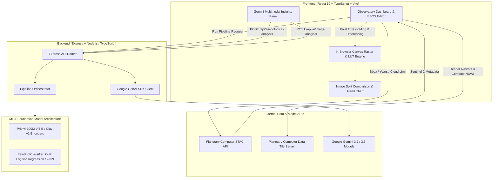

# 🌊 AquaSense: Earth Observation & AI-Powered Hydrological Observatory

[](https://react.dev/)
[](https://www.typescriptlang.org/)
[](https://vitejs.dev/)
[](https://tailwindcss.com/)
[](https://expressjs.com/)
[](https://ai.google.dev/)
[](https://planetarycomputer.microsoft.com/)

**AquaSense** is a full-stack Earth Observation (EO) and geospatial hydrological observatory designed for automated satellite imagery ingestion, Normalized Difference Water Index (NDWI) temporal quantification, few-shot land-cover classification, and multimodal ecological intelligence powered by Google Gemini.

---

## 📌 Table of Contents

- [Key Capabilities & Features](#-key-capabilities--features)
- [System Architecture](#-system-architecture)
- [Core Technologies](#-core-technologies)
- [Project Directory Structure](#-project-directory-structure)
- [Getting Started](#-getting-started)
  - [Prerequisites](#prerequisites)
  - [Installation](#installation)
  - [Environment Configuration](#environment-configuration)
  - [Running the Development Server](#running-the-development-server)
  - [Building for Production](#building-for-production)
- [API Endpoints Reference](#-api-endpoints-reference)
- [Geospatial & Machine Learning Foundations](#-geospatial--machine-learning-foundations)
  - [Normalized Difference Water Index (NDWI)](#normalized-difference-water-index-ndwi)
  - [Few-Shot Embedding Classifier](#few-shot-embedding-classifier)
  - [Earth Observation Foundation Models](#earth-observation-foundation-models)
- [Google Gemini Multimodal AI Engine](#-google-gemini-multimodal-ai-engine)
- [Interactive Observatory Tools](#-interactive-observatory-tools)
- [Data Provenance & Scientific Audit Export](#-data-provenance--scientific-audit-export)
- [License & Acknowledgments](#-license--acknowledgments)

---

## 🚀 Key Capabilities & Features

### 🛰️ Direct STAC Earth Observation Ingestion
- **SpatioTemporal Asset Catalog (STAC)** integration with **Microsoft Planetary Computer**.
- Automatic querying of **Sentinel-2 Level-2A (Bottom-of-Atmosphere Reflectance)** multispectral scenes.
- Dynamic cloud-cover filtering with configurable thresholds (`<1%` strict to `<80%`).
- **Resilient Fallback Scene Resolution**: Automatically tests and falls back across candidate scenes if raster processing encounters server or tile anomalies.

### 💧 Real-Time NDWI Hydrological Quantification
- Computes NDWI via band mathematics:
  $$\text{NDWI} = \frac{B03 (\text{Green}) - B08 (\text{NIR})}{B03 (\text{Green}) + B08 (\text{NIR})}$$
- Interactive real-time **NDWI Threshold Slider** (`-0.30` wet flora to `+0.70` deep water) with instant sub-second in-browser canvas recalculation.
- Precise spatial quantification calibrated to Sentinel-2's **10m spatial resolution** ($0.0001\text{ km}^2/\text{pixel}$).

### 🎨 Scientific Color Ramp Look-Up Tables (LUT)
- Dynamic 256-color gradient Look-Up Tables for false-color raster visualization:
  - **Viridis** (Perceptually Uniform High-Contrast)
  - **Inferno** (Thermal Inundation Scale)
  - **Cividis** (Colorblind Safe)
  - **Turbo** (Rainbow Hydro Spectrum)
  - **Mako** (Deep Ocean Hydro Metric)
  - **Blues** (Traditional Hydrological Scale)
  - **Chlorophyll** (Wetland Vegetation-Water Hybrid)
- Live colorbar needle indicator showing the active threshold point.

### 🌓 Interactive Spatial & Temporal Visualizations
- **Split-Screen Swipe Sliders**: Drag-to-compare baseline vs. target epochs in True Color ($RGB$) or NDWI false-color.
- **Hydrological Difference Mask**: Tri-color spatial change detection:
  - 🔵 **Water Gained (Inundation/Expansion)**: Electric Blue
  - 🔴 **Water Lost (Desiccation/Encroachment)**: Signal Red
  - 🔷 **Persistent Water Extent**: Scaled Colormap Blue
- **Multi-Year Longitudinal Trendlines**: Interactive time-series charts generated via intermediate annual STAC scene sampling.

### 🗺️ Dynamic Bounding Box & GeoJSON Boundary Editor
- Interactive canvas map with draggable 8-point anchor handles for bounding box adjustment.
- Real-time zoom (`0.4x` to `5.0x`) and spatial centering.
- Direct **GeoJSON file upload** with automatic spatial bounding box calculation using `@turf/turf`.

### 🧠 Multimodal Gemini AI Ecological Synthesis
- **Deep Reasoning Synthesis** (`gemini-3.7-flash`): Authoritative ecological reports assessing wetland trajectory, driving factors, and conservation interventions.
- **Google Search Grounding** (`gemini-3.5-flash`): Live integration with Google Search for recent environmental news, governmental interventions, and climate reports.
- **Google Maps Grounding** (`gemini-3.5-flash`): Geographic landmark detection, urban proximity analysis, and ecological sanctuary mapping.
- **Multimodal Field Photo Ground-Truthing** (`gemini-3.7-flash`): Upload ground-level, drone, or aerial photographs to validate water clarity, eutrophication, and land cover classification.

---

### 🖥️ Local Hydrological RAG & 12-D Spectral Classifier
A sovereign, cloud-free intelligence path that runs entirely in-process with deterministic latency (no GPU/cloud dependency):
- **12-Dimensional Spectral Feature Extractor** (`ml/encoders/spectral_12d.ts`): derives `B02, B03, B04, B08, NDWI, MNDWI, NDTI, NDCI, VV, VH, ΔDEM, WQI` from multi-sensor band physics and implements the `EOEncoder` interface (now the default encoder).
- **Few-Shot Classifier** (`ml/classifiers/few_shot.ts`): logistic-regression head trained on physically-grounded water / wetland / built_up reference prototypes, predicting per-patch land-cover.
- **Local RAG Engine** (`backend/rag/`): an in-memory TF-IDF vector store over statutory/scientific knowledge (Ramsar, CPCB Classes A–E, WHO turbidity, Carlson TSI, NDTI/NDCI bio-optics, ERA5 monsoon, regional basins) with cosine top-K retrieval and a structured on-device synthesizer.
- **Endpoints**: `POST /api/ai/spectral-embedding` (12-D vectors + classification) and `POST /api/ai/local-rag-analysis` (retrieval + synthesis). `POST /api/pipeline/run` now executes this local engine and returns `status: "SUCCESS"` with genuine classification and per-class area quantification.
- **UI**: a dedicated **"Local RAG"** tab in the AI Insights panel visualizes the 12-D spectral radar, few-shot confidence breakdown, retrieved knowledge chunks, and the local synthesis report.

## 🏛️ System Architecture



---

## 🛠️ Core Technologies

| Layer | Technology | Purpose |
|---|---|---|
| **Frontend Framework** | React 19 (`react`, `react-dom`) | Reactive UI components, state management, and lifecycle |
| **Language** | TypeScript (~5.8) | Full-stack end-to-end type safety |
| **Styling & Design** | Tailwind CSS v4 (`@tailwindcss/vite`) | Cartographic observatory theme with glassmorphism & responsive layouts |
| **Geospatial Processing** | `@turf/turf` | GeoJSON parsing, bounding box calculations, and geospatial math |
| **Charts & Visuals** | `recharts` | Multi-year longitudinal hydrological area trendlines |
| **Icons & Motion** | `lucide-react`, `motion` | Clean iconography and UI micro-animations |
| **Backend Server** | Express 4.x (`express`, `tsx`) | REST endpoints, image processing proxy, and AI orchestration |
| **Bundler & Dev Server** | Vite 6.x | High-speed HMR development server & production bundler |
| **AI / GenAI SDK** | `@google/genai` (^2.4.0) | Gemini 3.7 Flash, 3.5 Flash, Search & Maps Grounding |
| **Earth Observation Data** | Microsoft Planetary Computer STAC API | Sentinel-2 L2A surface reflectance rasters & expressions |

---

## 📂 Project Directory Structure

```plaintext
Aquasense/
├── backend/
│   ├── ai.ts                       # Google Gemini API integration (Deep reasoning, Search/Maps grounding, Vision)
│   ├── pipeline.ts                 # Full-scene EO processing orchestrator
│   └── pipeline/
│       └── jobs.py                 # Python backend pipeline job executor
├── geospatial/
│   └── area.ts                     # Area change calculation & Turf.js wrappers
├── ml/
│   ├── classifiers/
│   │   ├── base.py                 # Abstract base class for few-shot classifiers
│   │   ├── few_shot.py             # Python FewShotClassifier (Logistic Regression & k-NN)
│   │   ├── few_shot.ts             # TypeScript FewShotClassifier implementation & state persistence
│   │   ├── knn.py                  # k-Nearest Neighbors classifier
│   │   └── logistic.py             # One-vs-Rest regularized logistic regression classifier
│   ├── encoders/
│   │   ├── base.py                 # Base Earth Observation encoder
│   │   ├── clay.ts                 # Clay v1 foundation model stub
│   │   ├── factory.ts              # Encoder factory resolver
│   │   └── prithvi.py              # IBM-NASA Prithvi-100M ViT-B multispectral encoder
│   ├── inference/
│   │   └── patch_extraction.ts     # Spatial tiling & patch extraction utility
│   └── training/
│       └── fine_tune.py            # Model fine-tuning script
├── data/
│   └── planetary_computer/
│       ├── ingestion.py            # Python STAC ingestion worker
│       └── stac.ts                 # TypeScript STAC query client
├── src/
│   ├── components/
│   │   ├── AiEcologicalInsights.tsx # Gemini AI tabs: Synthesis, Grounding, Field Photo Validation
│   │   ├── BboxMapEditor.tsx       # Interactive 8-point anchor draggable BBOX editor
│   │   ├── ColorRampSelector.tsx   # Scientific LUT color ramp picker & needle legend
│   │   └── ImageSplitSlider.tsx    # Drag-to-compare split raster slider component
│   ├── utils/
│   │   ├── colorRamps.ts           # 256-color LUT palettes (Viridis, Inferno, Turbo, Mako, etc.)
│   │   └── rasterAnalysis.ts       # Pixel counting, LUT colorization & difference mask generation
│   ├── App.tsx                     # Main Cartographic Observatory Interface
│   ├── index.css                   # Global styles & Tailwind CSS v4 imports
│   └── main.tsx                    # React application entry point
├── server.ts                       # Unified Express + Vite development and production server
├── package.json                    # Dependencies and npm scripts
├── tsconfig.json                   # TypeScript compiler configuration
├── vite.config.ts                  # Vite build and plugin setup
└── .env.example                    # Environment variable template
```

---

## ⚡ Getting Started

### Prerequisites
- **Node.js** (v18.0.0 or higher, recommended v20+)
- **npm** (v9+ or yarn / pnpm)
- **Google Gemini API Key** (Get one at [Google AI Studio](https://aistudio.google.com/))

### Installation
Clone the repository and install project dependencies:

```bash
git clone https://github.com/Naeha-S/Aquasense.git
cd Aquasense
npm install
```

### Environment Configuration
Create a `.env` file in the root directory:

```bash
cp .env.example .env
```

Add your Gemini API key:

```env
# GEMINI_API_KEY: Required for Gemini AI Ecological Intelligence calls
GEMINI_API_KEY="your_actual_gemini_api_key_here"

# APP_URL: Optional host URL
APP_URL="http://localhost:3000"
```

### Running the Development Server
Start the unified Express + Vite development server:

```bash
npm run dev
```
Open your browser and navigate to:
```
http://localhost:3000
```

### Building for Production
To build the client bundle and bundle the server:

```bash
npm run build
npm start
```

---

## 📡 API Endpoints Reference

### 1. Health Check
- **Endpoint**: `GET /api/health`
- **Response**: `{"status": "ok"}`

### 2. Machine Learning Pipeline Execution
- **Endpoint**: `POST /api/pipeline/run`
- **Body**:
  ```json
  {
    "aoi": { "bbox": [80.20, 12.91, 80.23, 12.95] },
    "years": [2019, 2025],
    "referencePatches": []
  }
  ```
- **Description**: Triggers the Earth Observation pipeline to fetch STAC data, extract patches, generate embeddings, and classify scenes.

### 3. Gemini Ecological Analysis
- **Endpoint**: `POST /api/ai/ecological-analysis`
- **Body**:
  ```json
  {
    "waterBodyName": "PALLIKARANAI_MARSH_CHENNAI",
    "bbox": [80.20, 12.91, 80.23, 12.95],
    "years": ["2019", "2025"],
    "areaA": 4.12,
    "areaB": 3.48,
    "pctChange": -15.53,
    "mode": "deep_reasoning"
  }
  ```
- **Supported Modes**:
  - `deep_reasoning` (`gemini-3.7-flash`): Detailed hydrological and conservation synthesis.
  - `search_grounded` (`gemini-3.5-flash`): Live search-grounded environmental investigation.
  - `maps_grounded` (`gemini-3.5-flash`): Geographic feature and protected zone identification.
  - `fast_summary` (`gemini-3.1-flash-lite`): Low-latency bulleted overview.

### 4. Multimodal Field Photo Understanding
- **Endpoint**: `POST /api/ai/image-analysis`
- **Body**:
  ```json
  {
    "imageBase64": "<base64_encoded_jpeg_or_png>",
    "mimeType": "image/jpeg",
    "prompt": "Analyze water clarity, vegetation encroachment, and class confidence."
  }
  ```
- **Description**: Uses `gemini-3.7-flash` to analyze field photos, drone imagery, or raster snapshots for ground-truth ecological validation.

---

## 🔬 Geospatial & Machine Learning Foundations

### Normalized Difference Water Index (NDWI)
The Normalized Difference Water Index utilizes the differential reflectance of water between visible green light ($B03$, $\approx 560\text{ nm}$) and near-infrared ($B08$, $\approx 842\text{ nm}$):
- Pure water exhibits high reflectance in green wavelengths and near-zero reflectance in near-infrared.
- Terrestrial vegetation and built infrastructure exhibit high NIR reflectance.
- Planetary Computer rescales raw $[-1, 1]$ floating point NDWI rasters into $[0, 255]$ 8-bit grayscale.
- AquaSense maps the user-selected threshold cutoff $T \in [-1, 1]$ to pixel cutoff $C \in [0, 255]$:
  $$C = \text{round}\left(\frac{T + 1}{2} \times 255\right)$$

### Few-Shot Embedding Classifier
The `FewShotClassifier` module (`ml/classifiers/few_shot.ts` and `few_shot.py`) provides lightweight classification on top of frozen high-dimensional foundation model embeddings:
- **One-vs-Rest Logistic Regression**:
  $$P(y = c \mid \mathbf{x}) = \sigma(\mathbf{w}_c^T \mathbf{x} + b_c)$$
  Fitted with $L_2$ regularization and class-balanced gradient updates.
- **Cosine k-Nearest Neighbors**:
  $$\text{dist}(\mathbf{u}, \mathbf{v}) = 1 - \frac{\mathbf{u} \cdot \mathbf{v}}{\|\mathbf{u}\|_2 \|\mathbf{v}\|_2}$$
  Weighted voting by inverse distance ($w_i = \frac{1}{\text{dist}_i + \epsilon}$).
- **State Serialization**: Save and load complete model weights and reference vectors via JSON.

### Earth Observation Foundation Models
- **IBM-NASA Prithvi-100M**: Vision Transformer (ViT-Base) trained on Sentinel-2 multispectral imagery (6 bands: Blue, Green, Red, Narrow NIR, SWIR 1, SWIR 2) yielding 768-dimensional patch representations.
- **Clay v1**: Foundation model for global multitemporal satellite representations.

---

## 🤖 Google Gemini Multimodal AI Engine

AquaSense integrates Google's latest Gemini models for multi-tiered scientific reasoning:

```
                          ┌───────────────────────────┐
                          │  Google Gemini Engine     │
                          └─────────────┬─────────────┘
                                        │
      ┌──────────────────┬──────────────┴─────────────┬──────────────────┐
      │                  │                            │                  │
┌─────▼──────────┐ ┌─────▼──────────┐          ┌──────▼───────────┐ ┌────▼─────────────┐
│ Deep Reasoning │ │ Search Grounded│          │  Maps Grounded   │ │ Multimodal Vision │
│ gemini-3.7-flash│ │gemini-3.5-flash│          │ gemini-3.5-flash │ │ gemini-3.7-flash  │
│                │ │ + Google Search│          │ + Google Maps    │ │ (Field Photos)    │
└────────────────┘ └────────────────┘          └──────────────────┘ └───────────────────┘
```

1. **Autonomous Fallbacks**: If primary reasoning queries encounter temporary rate limits or latency thresholds, requests gracefully fall back between `gemini-3.7-flash`, `gemini-3.5-flash`, and `gemini-3.1-flash-lite`.
2. **Grounding Citation Metadata**: Returns structured `groundingChunks` with live web citations and geographic landmarks.

---

## 🖥️ Interactive Observatory Tools

- **8-Point Anchor Bounding Box Editor**: Click and drag corners (`NW`, `NE`, `SE`, `SW`) or edges (`N`, `S`, `E`, `W`) or pan the center to define any custom study region worldwide.
- **Dynamic NDWI Thresholding**: Instant client-side canvas re-rendering to explore seasonal water fluctuations, shallow mudflats, and open deep water.
- **Longitudinal Trend Chart**: Interactive Recharts visualization tracking year-over-year surface water changes across intermediate STAC captures.

---

## 📑 Data Provenance & Scientific Audit Export

Clicking **"Export GeoJSON & Provenance JSON"** generates a reproducible scientific audit payload containing:
- ISO 8601 Timestamp & Cryptographic System Hash
- Exact AOI Coordinates and GeoJSON Bounding Box
- Filter Parameters (Max Cloud Cover %, NDWI Threshold, Colormap LUT)
- Baseline ($T_0$) & Target ($T_1$) Scene Identifiers from ESA Sentinel-2
- Pixel Area Quantification ($\text{km}^2$, absolute difference, percentage change)

---

## 📄 License & Acknowledgments

- **License**: Released under the [MIT License](LICENSE).
- **Satellite Data**: Courtesy of European Space Agency (ESA) Copernicus Sentinel-2, accessed via Microsoft Planetary Computer STAC API.
- **AI Models**: Powered by Google DeepMind's Gemini API family.
